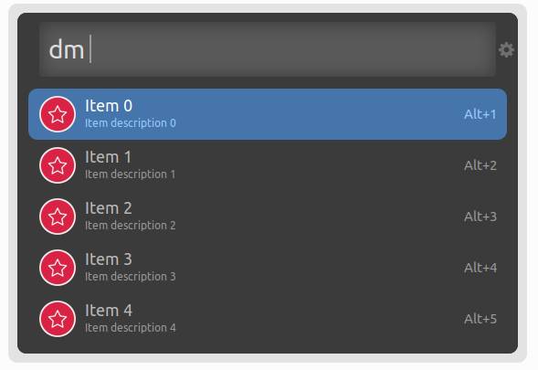
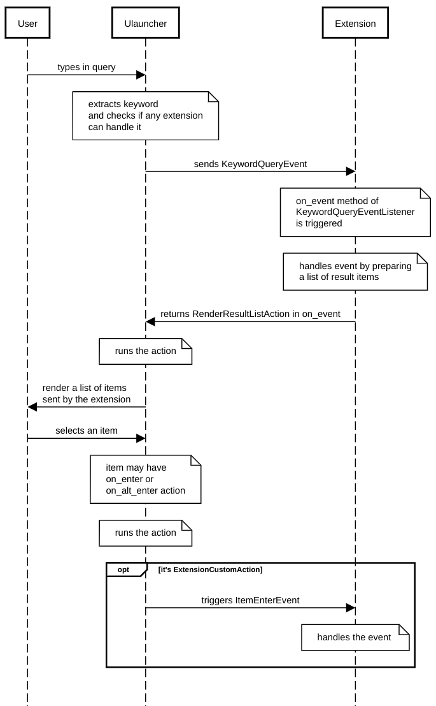

## Creating a Project

Ulauncher runs all extensions from `~/.local/share/ulauncher/extensions/`.

Create a new local git repository:

```sh
# you can also create a repo online on github for example and then clone it locally
git init demo-extension
cd demo-extension
# example .gitignore (you likely will want to use your own)
printf "*tmp*\n__pycache__\n.cache\n.mypy_cache\n*.pyc\n*.pyo" > .gitignore
touch manifest.json main.py
```

- `.gitignore` is for ignoring file paths for common cached files and similar that you don't want to add to your repo.
- `manifest.json` contains all necessary metadata
- `main.py` is an entry point for your extension

## manifest.json

Create `manifest.json` using the following template:

```json
{
  "api_version": "3",
  "authors": "John Doe",
  "name": "Demo extension",
  "icon": "system-run",
  "instructions": "You need to install <code>examplecommand</code> to run this extension",
  "triggers": {
    "dm": {
      "name": "Demo",
      "description": "Demo extension",
      "keyword": "dm"
    }
  }
}
```

- `api_version` - the version(s) of the Ulauncher Extension API (not the main app version) that the extension requires. See above for more information.
- `authors` - the name(s) or user name(s) of the extension authors and maintainers
- `name` can be anything you like but not an empty string
- `icon` - relative path to an extension icon, or the name of a [themed icon](https://specifications.freedesktop.org/icon-naming-spec/icon-naming-spec-latest.html#names), for example "system-run" or "edit-paste".
- `triggers` - User triggers to activate your extension (see below for details).
- `preferences` - Optional user preferences (see below for details).
- `instructions` - Optional installation instructions that is shown in the extension preferences view.
- `input_debounce` - Default - `0.05`. Time to wait while the user is typing before sending the input event to the extension. Raise to higher values like `1` for slow I/O operations like network requests.
  They are rendered in Ulauncher preferences in the same order they are listed in manifest.

*`triggers` and `preferences` are key/value objects. The key should be a unique identifier that never changes (if you change it you will break user settings). For triggers the key is also what you use to distinguish which trigger was called in your callback event.*

### Triggers

`name` (required) - The name of the trigger. This is what users will see if they search for your extension in Ulauncher.

`description` - Optional description to go with the name.

`keyword` - The extension default keyword (users can override this).
  Specify a keyword if you want the trigger to be an "input trigger" and ask let the user type text that's passed to your extension's `on_input`-method (takes two arguments "input_text" and "trigger_id").
  If you instead want it to be a "launch trigger" and trigger immediately when activated, then leave the keyword out. Then you can listen to it with your extensions `on_launch`-method (takes only "trigger_id").

`icon` - Optional icon (path or themed icon). If not specified it will use the extension icon

### Preferences

`type` (required) - Can be "input", "checkbox", "number", "text", or "select"

- input - rendered as a single line text input
- checkbox - rendered as a checkbox
- number - rendered as a single line number input
- text - rendered as a multiple line text input
- select - rendered as list of options to choose from

`name` (required) - Name of your preference. If type is "keyword" name will show up as a name of item in a list of results

`default_value` (required) - Default value

`description` - Optional description

`min` and `max` - Optional for type "number". Must be a non-decimal number

`options` - Required for type "select". Must be a list of strings or objects like: `{"value": "...", "text": "..."}`

## main.py

Copy the following code to `main.py`:

```py
from ulauncher.api import Extension, Result


class DemoExtension(Extension):
    def on_input(self, input_text, trigger_id):
        for i in range(5):
            yield Result(
                name='Item %s' % i,
                description='Item description %s' % i
            )

if __name__ == '__main__':
    DemoExtension().run()
```

*If you don't want to use `yield`, you can also return a list of Results.*

To test your extension, install your extension using the system path as the url. Ex `file:///home/me/mycode/demo-extension` or just `/home/me/mycode/demo-extension`
Ulauncher only installs from git repositories, so you need to commit your changes.
To update an extension you installed this way, you simply use the regular update functionality.
For testing purposes we highly recommend you exit ulauncher and run `ulauncher -v` in a terminal for verbose output.



When you type in "dm " (the keyword of the trigger that you defined earlier followed by a space) you'll get a list of items.
This is all this extension will do for now.

## Basic API Concepts


*Message flow*

### 1. Define extension class and the \`on_input\` listener

Create a subclass of {class}`~ulauncher.api.Extension`.

```py
class DemoExtension(Extension):

    def on_input(self, input_text, trigger_id):
        # `input_text` (str) is the user input (after the keyword).
        # `trigger_id` (str) is the id (key) of the trigger, as specified in the manifest.

        ...
```

`on_input` is new for the extension API v3. Previously this was handled by manually binding the events.

### 2. Render results

Return a list of {class}`~ulauncher.api.Result` in order to render results.

```py
class DemoExtension(Extension):
    def on_input(self, input_text, trigger_id):
        for i in range(5):
            yield Result(
                name='Item %s' % i,
                description='Item description %s' % i
            )
```

### 3. Run extension

```py
if __name__ == '__main__':
    DemoExtension().run()
```

### 4. Add an action

The result above has name and description, but it doesn't have any action for when it's activated. The easiest way to add an action is with `on_enter`.

{code}`on_enter` an action that will run when the result is activated with enter keypress (or by clicking).

```py
from ulauncher.api.shared.action.CopyToClipboardAction import CopyToClipboardAction
...

Result(
    name='Name',
    description='Description',
    on_enter=CopyToClipboardAction('Text to copy')
)
```

It can be one of

- `False` - Close the Ulauncher window open (default)
- `True` - Keep the Ulauncher window open
- A string value - Set the query
- A list of results - Render new result list
- CopyToClipboardAction - Copy text to clipboard
- OpenAction - Open a URL or path in the default browser or application
- ExtensionCustomAction - Handle more complex actions with a custom method (see below)
- ActionList - List of actions

## Custom Action on Item Enter

### 1. Pass custom data with ExtensionCustomAction

Instantiate {class}`~ulauncher.api.Result`
with `on_enter` that is instance of {class}`~ulauncher.api.shared.action.ExtensionCustomAction.ExtensionCustomAction`

```py
data = {'new_name': 'Item %s was clicked' % i}
Result(
    name='Item %s' % i,
    description='Item description %s' % i,
    on_enter=ExtensionCustomAction(data, keep_app_open=True)
)
```

`data` is passed to your callback function. It can be any type.

### 2. Define a new listener

```py
class DemoExtension(Extension):
    def on_input(self, input_text, trigger_id):
        ...

    def on_item_enter(self, data):
        # data is whatever you passed as the first argument to ExtensionCustomAction
        # do any additional actions here...

        # you may want to return another list of results
        yield Result(
            name=data['new_name']
        )
```


Now this will be rendered when you click on any item
